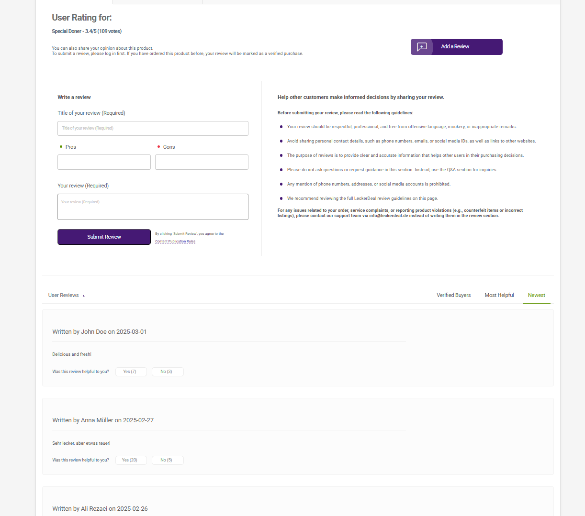

# 🍽️ LeckerDeal - Discounted Food Ordering Platform

🚧 **This project is not yet complete.**  
Currently, only the **frontend (React)** is ready, and **the backend (ASP.NET Core) will be added in the future.**

---

## 🎯 Project Goal

LeckerDeal is an online platform for **restaurants and customers** with a primary focus on **discounted food products**.  
Restaurant owners can **manage their menu and discounts**, while customers can **search for and order discounted meals**.

Additionally, each restaurant has a **dedicated page** on the website, allowing customers to access their full menu via:

leckerdeal.de/restaurant_name

---

## ✅ **Project Status**

### **🔹 Completed Sections**
✅ **Home Page (Landing Page) Design**  
✅ **Product Details Page**  
✅ **Responsive Design for Mobile & Desktop**  

### **🔸 Work in Progress**
🚧 **Dedicated Restaurant Pages**  
🚧 **Product Search System (Displaying search results on a separate page)**  
🚧 **Admin Panel**  
🚧 **Backend (ASP.NET Core)**  

---

## 🔥 **Project Features**

### **📌 Home Page**
- **Header** → Includes **Logo, Language Switcher, Login, and Shopping Cart**
- **Main Navigation Menu**  
- **Promotional Slider for Restaurants**  
- **Timed Flash Deals Slider**  
  - Restaurants can list their products with a **limited-time offer**, which expires after the timer runs out.  
- **Shop of the Week**  
  - Based on the **best customer reviews**  
  - Restaurants must **pay a fee** to be featured in this section.  
- **4 Special Promotional Banners** displaying top discount categories  
- **Two Swipers (Carousels) for Discounted Products**  
  - The site administrator selects featured products  
- **4 Informational Banners** such as:  
  - **Become a Seller Today**  
  - **Everything About Our Seller**  
- **Two More Swipers for Popular Food Categories**  
  - Example: **"Top Persian Dishes"** or **"Best Seafood Offers"**  
- **Website Footer**  

---

### **📌 Product Details Page**
- **Product Name and Customer Rating**  
- **List of Ingredients & Product Images**  
- **Discount Percentage & Add to Cart Button**  
- **User Reviews and Q&A Sections**  

📌 **User Reviews:**  
- Customers can leave reviews.  
- If they have purchased the item, they receive a **"Verified Buyer" tag**.  
- Reviews can be **liked or disliked**.  
- **Sorting Options for Reviews:**  
  1. **Verified Buyer**  
  2. **Most Helpful**  
  3. **Newest**  

📌 **Q&A Section:**  
- Customers can **ask questions** and see previous answers.  
- The restaurant owner and other users can **respond** to questions.  
- **Sorting Options for Questions:**  
  1. **Latest**  
  2. **Most Answered**  
  3. **Your Questions**  

---

### **📌 Dedicated Restaurant Pages**
🚀 **Each restaurant has its own unique page, which is separate from the main site.**  
- **Each restaurant has a personal landing page** accessible via:  leckerdeal.de/restaurant_name

- **Customers can place orders directly from the restaurant's page.**  
- **When clicking on a product from the restaurant page:**  
- A **modal (popup)** opens, showing a summary of the food item (name, rating, ingredients, Add to Cart button).  
- To view full details, the customer must **visit the product details page**.  
- **The layout of the restaurant page is different from the main site** and displays only that restaurant’s information.  
- This page includes:  
✅ **Custom restaurant banner**  
✅ **Restaurant logo**  
✅ **Exclusive menu for that restaurant (with site-wide categories)**  
✅ **Clickable products leading to detailed product pages**  
✅ **Ability to add food to the cart directly from the restaurant page**  
✅ **User reviews and Q&A section**  

---

### **📌 Search Results Page**
- When a user searches for an item (e.g., "Vegetable Pizza"), **a separate page will display only discounted products** that match the search.  
- **The search results page filters out non-discounted products.**  

---

## 🖼️ Screenshots

### **Home Page**

### **Product Details Page**

<<<<<<< HEAD
### **Review in Product Details**

### **PQ&A in Product Detail**

=======
### **User Review in Product Details Page**

### **Q&A in Product Details Page**

>>>>>>> 79cf657 (Backup before deleting main)

---

## 🌐 Live Demo (Test Version)
- **Home Page:** [javaheri.shop](https://javaheri.shop)
- **Product Details Page:** [javaheri.shop/product-example](https://javaheri.shop/restaurant/100001/product/101) *(Replace with actual link)*

---

## ⚡ **Future Plans**
🔹 **Integration with the Windows-based Cafe Manager software**  
🔹 **Connecting restaurant pages to an admin panel for menu management and order handling**  
🔹 **Adding an online payment system**  
🔹 **UI/UX optimization for a better customer experience**  

---

## ⚠️ **License & Usage**
🚨 **This project is strictly for portfolio purposes.**  
❌ **Commercial use, modification, or redistribution without permission is prohibited.**  

📩 **For inquiries or licensing requests, contact me at:**  
📧 **mahan@javaheri.work**  

© 2025 **Mahan Javaheri** – All Rights Reserved.
<<<<<<< HEAD
=======

>>>>>>> 79cf657 (Backup before deleting main)
